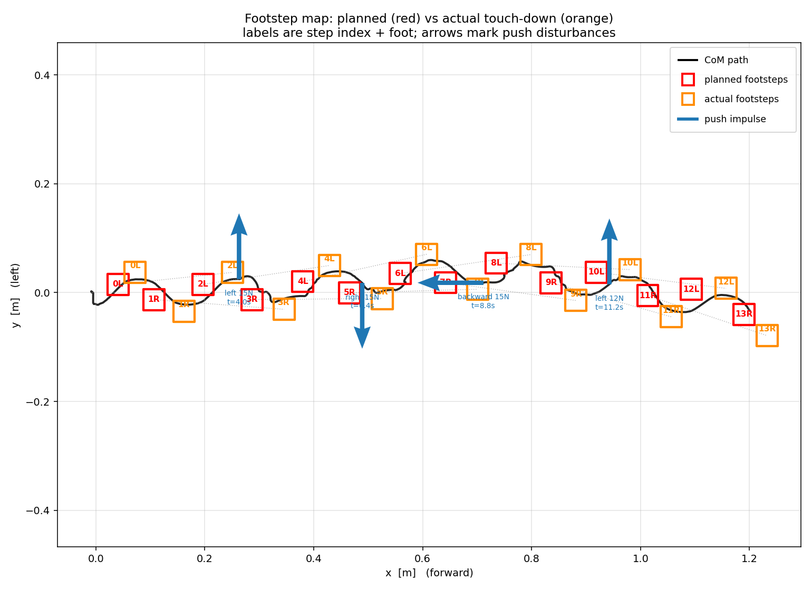
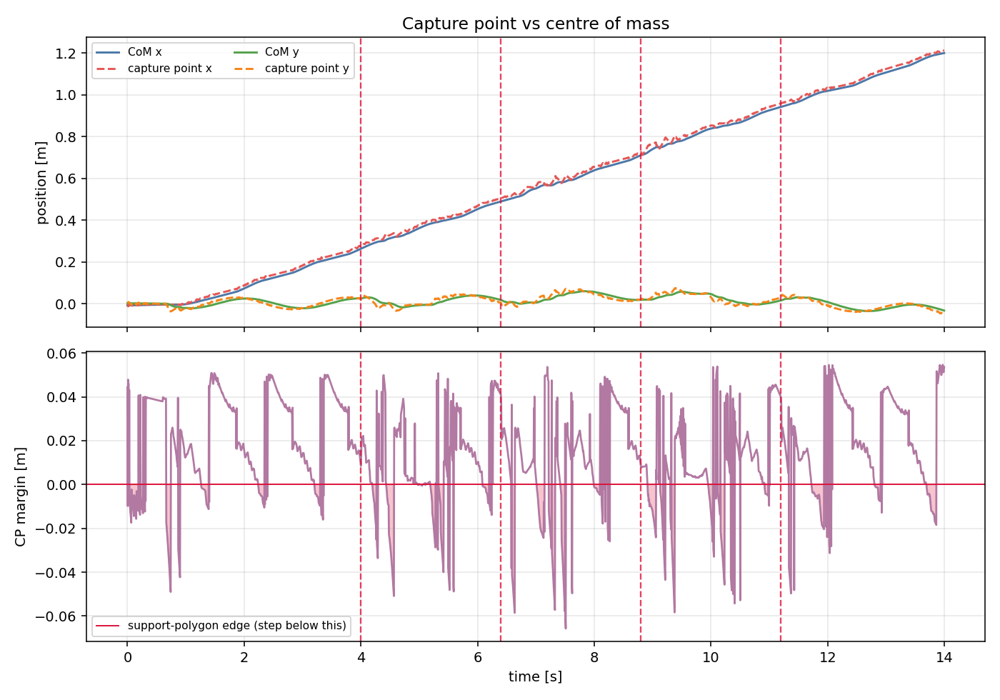
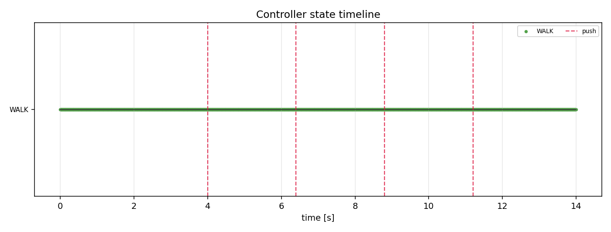
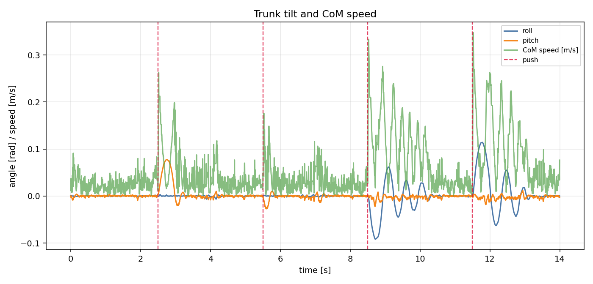
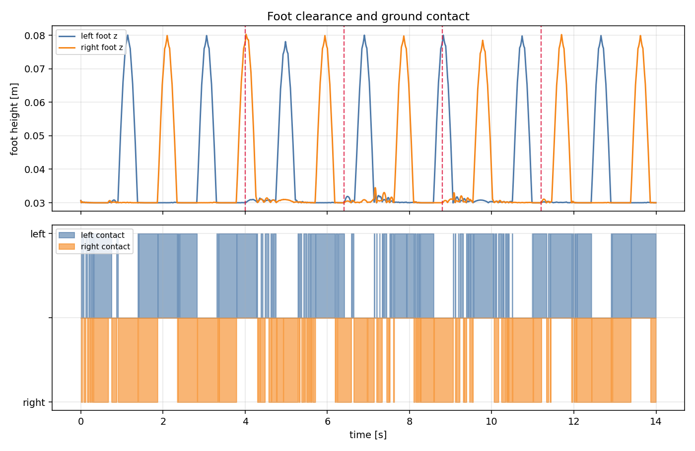

# Bipedal Walking and Push Recovery

<p align="center">
  
  
  
  
  
  
  
  
</p>

A 12-DoF bipedal robot that **walks** in PyBullet and **stays upright when you
push it**, using classical balance control: capture point, support polygon, and
the ankle / hip / stepping strategy hierarchy.

Everything claimed below is measured by the scripts in this repo, not estimated
— including [the part that does not work](#known-limitation-stepping-recovery).

<p align="center">
  
</p>

---

## Results

| Capability | Result | Reproduce |
|---|---|---|
| Walking | **1.209 m** in 14 s, no falls | `python run_simulation.py --scenario walk` |
| Standing push recovery | recovers **25 N** impulses in **all four directions** — CoM height unchanged (0.232 → 0.232 m), trunk tilt ±0.000 rad | `python run_simulation.py --scenario stand` |
| Walking under disturbance | absorbs **4 × 12–15 N** pushes mid-stride and keeps walking | `python run_simulation.py --scenario walk_push` |
| Unit / integration tests | **33 / 33** | `python test_robot.py` |

Push magnitudes are impulses: force × 0.02 s applied at the trunk. On a 1.74 kg
robot a 25 N impulse is roughly **1.5× body weight**, which is a hard shove.

---

## Robot model

`robot/humanoid_leg_12dof.urdf` — a small, leg-only biped. The gait generator
and this model are adapted from
[Einsbon/bipedal-robot-walking-simulation](https://github.com/Einsbon/bipedal-robot-walking-simulation)
(check that repository's licence before redistributing the model).

| Property | Value |
|---|---|
| Degrees of freedom | 12 (6 per leg) |
| Joint chain per leg | hip yaw → hip roll → hip pitch → knee → ankle pitch → ankle roll |
| Total mass | 1.744 kg |
| Standing CoM height | 0.232 m |
| Thigh / shank | 110 mm / 110 mm |
| Foot | 100 × 53 mm |
| Hip-to-hip width | 70.5 mm |
| Servo limits | 1.5 N·m, **5 rad/s**, position-controlled |
| Physics rate | 2000 Hz, 200 solver iterations |

> An earlier version of this project targeted Atlas v4 (182 kg, CoM at 1.08 m).
> It was abandoned: that robot is too heavy and top-heavy to stabilise with
> analytic IK under position control, and it toppled within one second of
> entering single support every time.

---

## How it works

```
                 ┌──────────────┐
   sensors ─────▶│  capture pt  │  ξ = x_com + ẋ_com / ω ,  ω = √(g/z)
                 │  support poly│  convex hull of feet in contact
                 └──────┬───────┘
                        │ margin = signed distance of ξ to the polygon edge
                 ┌──────▼───────┐
                 │ state machine│  STAND / WALK / ANKLE / HIP / STEP / FALLEN
                 └──────┬───────┘
       ┌────────────────┼────────────────┐
       ▼                ▼                ▼
  ankle strategy   hip strategy    stepping strategy
  (ankle pitch/    (trunk pitch    (foot placement
   roll offsets)    against fall)   toward ξ)
       └────────────────┼────────────────┘
                        ▼
              analytic leg IK ──▶ 12 joint targets ──▶ position-controlled servos
```

| Module | Contents |
|---|---|
| `simulation/` | PyBullet world, robot interface, push applicator |
| `kinematics/` | analytic 6-DoF leg IK, joint index mapping |
| `walking/` | feed-forward gait generator, LIPM helpers |
| `balance/` | capture point, support polygon, ankle / hip / stepping strategies |
| `control/` | balance state machine, main controller, motor driver |
| `tools/` | CSV logger, plot generator, MP4 recorder |
| `logs/` | recorded runs: time series, events, footsteps, and figures |

The balance feedback is **gated during walking**: the gait already contains a
large designed body sway, and letting the tilt controller fight it destabilises
the walk. Recovery only interrupts a stride on a genuinely abnormal disturbance.

---

## Quick start

```bash
pip install -r requirements.txt
python visualize.py
```

`visualize.py` opens a guided tour — standing balance, ankle strategy, hip
strategy, walking, and walking while being pushed — then hands you the controls:

| Key | Action |
|---|---|
| arrow keys | push forward / backward / left / right |
| `SHIFT`+arrow | hard push (past the ankle limit — it will fall) |
| `SPACE` | toggle walking |
| `R` | reset · `N` next phase · `Q` quit |

> PyBullet's viewer reserves `A C D G I J K L O P S V W`, `Esc`, `F1`, `F3` for
> its own debug functions (`W` is wireframe, `S` shadows, `G` hides panels), so
> this demo binds only keys outside that set.

Headless runs with logging and figures:

```bash
python run_simulation.py --scenario walk_push --headless
python tools/plot_logs.py
```

Record an MP4 (needs `imageio-ffmpeg`):

```bash
python tools/record_demo.py --seconds 54 --width 1920 --height 1080
```

---

## Analysis output

Every run writes `logs/<run>/` containing `timeseries.csv`, `events.csv`,
`footsteps.csv`, `summary.json`, and a `plots/` folder.

**Capture point vs support margin** — the signal the controller acts on. When
the margin goes negative the capture point has left the support polygon.



**Controller state timeline** — which strategy was active, with pushes marked.



**Trunk tilt under four pushes** — each disturbance is absorbed and the tilt
returns to zero.



**Foot clearance and contact phases** — the alternating single/double support.



---

## Known limitation: stepping recovery

The stepping strategy is implemented (`balance/recovery_step.py`) and correctly
computes where to step, but **it does not save the robot on this hardware**, so
it is deliberately excluded from the demo tour.

Measured behaviour: when stepping triggers (≥ 35 N), the robot ends up on the
floor in 8 of 9 trials — CoM at ≈ 0.06 m, roll ≈ ±1.57 rad.

Two causes were found:

1. **Premature recentring** *(fixed)* — the feet were pulled back together
   ~0.2 s after the catch step, deleting the support base while the CoM was
   still moving at 0.5 m/s. Replaced with catch → hold-until-settled → slow
   recentre.
2. **Actuator saturation** *(not fixable by tuning)* — a catch step needs about
   **9 rad/s** at the hip; the servos are capped at **5 rad/s**.

| motor v-max | step duration | recovered |
|---|---|---|
| 5 rad/s (model spec) | 0.12 s | 0 / 4 |
| 5 rad/s | 0.25 s | 0 / 4 |
| 12 rad/s | 0.12 s | 2 / 4 |

Slowing the step does not help — the CoM is gone before the foot lands.
Making this work requires a faster actuator spec or a larger robot, not more
gain tuning.

---

## References

- Kajita et al., *Biped Walking Pattern Generation by Using Preview Control of
  the Zero-Moment Point*, ICRA 2003
- Pratt et al., *Capture Point: A Step Toward Humanoid Push Recovery*,
  Humanoids 2006
- Gait generator and robot model adapted from
  [Einsbon/bipedal-robot-walking-simulation](https://github.com/Einsbon/bipedal-robot-walking-simulation)
